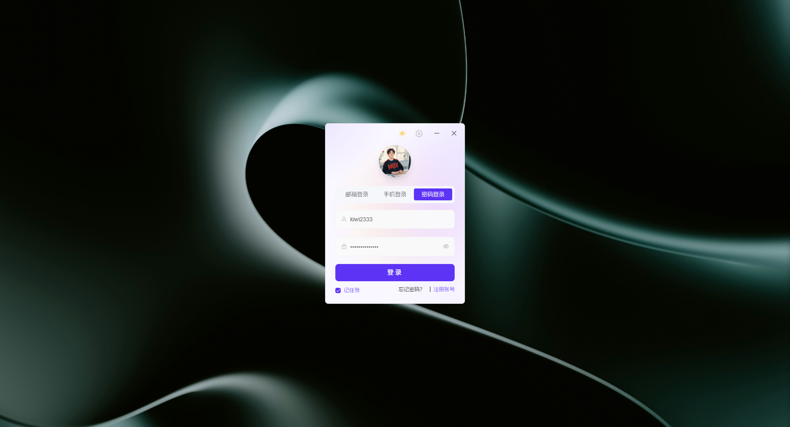
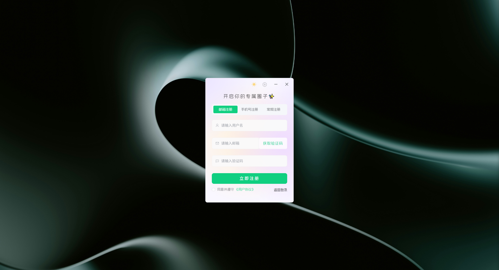

<div align=center>
 <div align=center margin="10em" style="margin:4em 0 0 0;font-size: 30px;letter-spacing:0.3em;">

 </div>
 <h2 align=center style="margin: 2em 0;">JiwuChat Tauri APP</h2>

<div>
      <a href="https://github.com/Kiwi233333/jiwu-mall-chat-tauri" target="_blank">
        
      </a>
      <a href="https://github.com/Kiwi233333/jiwu-mall-chat-tauri/stargazers" target="_blank">
        
      </a>
    </div>
    <div>
      <a href="https://github.com/Kiwi233333/jiwu-mall-chat-tauri/commits" target="_blank">
        
      </a>
      <a href="https://github.com/Kiwi233333/jiwu-mall-chat-tauri/issues" target="_blank">
        
      </a>
    </div>
    <div>
      <a href="`https://github.com/Kiwi233333/jiwu-mall-chat-tauri/blob/main/LICENSE`" target="_blank">
          
      </a>
      <a href="https://app.netlify.com/sites/jiwuchat/deploys" target="_blank">
          
      </a>
      <a href="https://qm.qq.com/q/iSaETNVdKw" target="_blank">
        
      </a>
    </div>
    <div>
      <a href="https://www.deepseek.com/" target="_blank" style="margin: 2px;">
        
      </a>
    </div>

Sitio Web Oficial: [JiwuChat](https://blog.jiwuchat.top/)
<br>
Idioma : [简体中文](../README.md) | [English](./README.en.md) | [Deutsch](./README.de.md) | **Español** | [Français](./README.fr.md) | [日本語](./README.ja.md) | [한국어](./README.ko.md) | [Português](./README.pt.md) | [Русский](./README.ru.md)

</div>

## Introducción

JiwuChat es una aplicación de chat multiplataforma ligera `(~8MB)` construida con Tauri2 y Nuxt3. Soporta varias funciones de mensajería en tiempo real, bots de chat grupales de IA (integrados con `iFlytek Spark`, `KimiAI`, etc.), `llamadas de audio/video WebRTC`, compartir pantalla y compras con IA. Permite comunicación sin interrupciones entre dispositivos, soportando texto, imágenes, archivos y mensajes de voz, junto con chats grupales y configuraciones personalizables. Modo claro/oscuro disponible para redes sociales eficientes. ✨

## Un Código, Múltiples Plataformas


## Cuenta Predeterminada

- Usuario: ikun233
- Contraseña: 123456
- Demo: [Versión Web](https://jiwuchat.top/)

> ⚠ Nota: ~~Esta cuenta de prueba tiene permisos limitados (ej. sin subida de archivos, edición de perfil o cambio de contraseña).~~

> 👀 ¡Gracias por su apoyo! El proyecto aún está en desarrollo y el backend no es de código abierto todavía. Siéntase libre de compartir sus comentarios por correo electrónico o QQ.

## Lista de Características

| Módulo         | Descripción                                                                 | Estado |
|----------------|-----------------------------------------------------------------------------|--------|
| Módulo Usuario | Soporta login/registro vía cuenta, teléfono o email; gestión de perfil     | ✔      |
| Mensajería     | Soporta texto, imágenes, archivos, voz, @menciones, revocación, eliminar y respuestas IA | ✔      |
| Sesiones Chat  | Chats grupales, chats privados, fijado, roles (propietario, admin, etc.)   | ✔      |
| Contactos      | Ver, agregar y eliminar contactos                                          | ✔      |
| Actualizaciones Sistema | Auto-actualizaciones, anuncios de versión                            | ✔      |
| Seguridad Cuenta| Login, cambio de contraseña, seguridad de dispositivo, gestión estado online | ✔      |
| Módulo IA      | Soporta múltiples chatbots IA (ej. `DeepSeek`, `iFlytek Spark`, `KimiAI`)  | ✔      |
| Compras Inteligentes | Recomendaciones de productos con IA vía `Jiwu Circle`                | ✔      |
| Gestión Archivos| Descargar, abrir y eliminar archivos localmente                           | ✔      |
| Audio/Video    | Compartir pantalla basado en `WebRTC`, llamadas de voz y video             | ✔      |
| Otros          | Traducción IA, modo oscuro/claro, fuentes, rutas descarga personalizadas, soporte multi-OS | ✔      |

## Capturas de Pantalla

- App de Escritorio: Login / Registro





- Temas Claro / Oscuro


- Chatbots IA (DeepSeek, iFlytek Spark, Kimi AI) 🤩


- Llamadas Audio/Video (WebRTC)


- Compartir Pantalla


- Chat Social


- Compras IA (Impulsado por [Jiwu Circle](https://github.com/KiWi233333/jiwu-mall-sites))


- Cuenta y Seguridad


- Configuraciones


- Adaptación Móvil

<div>
 
 
 
 
 
 
 
 
 
 
 
 
 
</div>

## ⏳ Comenzando

### 📦 Instalar Dependencias

```sh
Node.js >= 18 requerido
npm install -g pnpm

pnpm install
```

### ✨ Desarrollo

- 📌 Si **no** tienes un servidor backend, modifica `.env.development` o usa `.env.production`.

```sh
Terminal 1: Iniciar Nuxt (Producción)
pnpm run prod:nuxt
Terminal 2: Iniciar Tauri
pnpm run dev:tauri
```

- Si **tienes** un backend, personaliza `.env.development` para desarrollo:

```sh
Recomendado ejecutar por separado
Terminal 1: Iniciar Nuxt
pnpm run dev:nuxt
Terminal 2: Iniciar Tauri
pnpm run dev:tauri
```

### 📦 Construcción

```sh
pnpm run build:tauri
```

### ❌ Errores de Instalación pnpm

Verificar registro:

```sh
pnpm get registry
```

Corrección temporal:

```sh
pnpm --registry https://registry.npm.taobao.org install any-touch
```

Cambio persistente:

```sh
pnpm config set registry https://registry.npm.taobao.org
```

Revertir:

```sh
pnpm config set registry https://registry.npmjs.org
```

## 🔧 Stack Tecnológico

| Categoría      | Tecnología/Componente      | Versión       |
|----------------|----------------------------|---------------|
| Framework      | Nuxt                       | ^3.14.159+    |
|                | Tauri                      | ^2.1.0        |
| Librería UI    | Element Plus               | ^2.8.4        |
| Gestión Estado | Pinia                      | 2.1.7         |
| Utilidad       | Vueuse                     | 10.11.0       |
| Herramientas Build | Nuxi                   | lts           |
|                | Vite                       | lts           |
| Calidad Código | ESLint                     | 8.56.0        |
|                | Prettier                   | 3.3.2         |
| Verificación Tipos | TypeScript             | 5.3.2         |
| Estilado       | Sass                       | 1.77.6        |

## 🦾 Tendencias


## 💬 Contacto

- Email: [kiwi2333@qq.com](mailto:kiwi2333@qq.com)
- QQ: [1329634286](https://wpa.qq.com/msgrd?v=3&uin=1329634286&site=qqq&menu=yes)
- Grupo QQ: [939204073](https://qm.qq.com/q/iSaETNVdKw)
