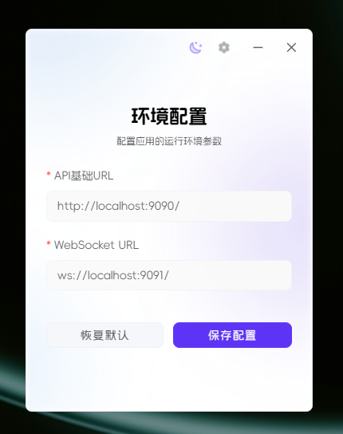
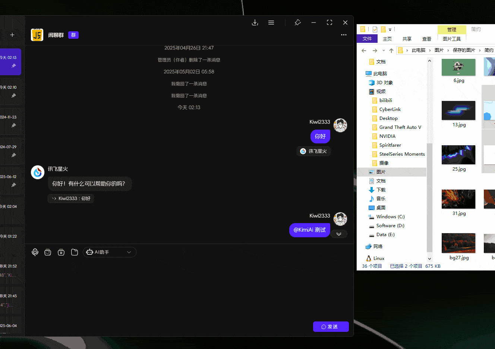

# 1.6.9 版本说明

这是一个重要的功能更新，包含多项界面优化和新功能 🚀

## ✨ 新功能

- [x] feat(compoent): 添加 `@(提及)` 和 `URL解析` 消息 💬 ([#34405fe](https://github.com/KiWi233333/JiwuChat/commit/34405feaef19e45ff915228be4022e4928af7a74))
- [x] feat(Chat): 增加 `URL 解析` 消息组件 🔗 ([#fc6e67b](https://github.com/KiWi233333/JiwuChat/commit/fc6e67b89635aa10c4dac9b23981e1dfcaa3fbe6))
- [x] feat(chat): 添加 at 成员 store 数据管理 📊 ([#0e503a6](https://github.com/KiWi233333/JiwuChat/commit/0e503a6acc43832090133575dc53b93d79697f39))
- [x] feat(chat): 添加输入表单`拖拽和粘贴插入图片、视频、文件等`功能 📷 ([#194d05a](https://github.com/KiWi233333/JiwuChat/commit/194d05a6291bed277ed4ba3fe9b3ce64403baeeb))
- [x] feat(Input): 优化 OssFileUpload 组件功能和性能 📂 ([#fb54193](https://github.com/KiWi233333/JiwuChat/commit/fb54193ded47cc4ed53ffa27ff7e228f087e39f6))
- [x] feat(Chat): 添加`私聊`(包括AI机器人)的会话信息抽屉 💬 ([#5b4e7a7](https://github.com/KiWi233333/JiwuChat/commit/5b4e7a7a2936fca544e1fed6ac045c32c29c90cd))
- [x] feat(chat): 优化聊天界面和导航逻辑 ✨ ([#acecd72](https://github.com/KiWi233333/JiwuChat/commit/acecd72d9bfd928d13d4452fa5844c8c72d9017c))
- [x] feat(env): 添加环境变量配置功能 (app增加一个切换服务器的入口#6) ⚙️ ([#ff087d3](https://github.com/KiWi233333/JiwuChat/commit/ff087d3cb33752a0fc77fb9a6c01d317e14bad0d))

## 🐛 修复了以下问题

- [x] fix(msgInput):  修复`@` `/` 无匹配项 回车无法发送消息问题 � ([#fdb4a24](https://github.com/KiWi233333/JiwuChat/commit/fdb4a2454c4e79c70b4fb501a80a5991ac3642fa))
- [x] fix(msgList): 修复`消息列表`初始化滚动错误 🔧 ([#d83bc2b](https://github.com/KiWi233333/JiwuChat/commit/d83bc2b77fa1cc12c24a6efb8bb5bacc8ab22f75))
- [x] fix(ai): 修复AI机器人房间输入框无法粘贴文本的问题 🔧 ([#692f941](https://github.com/KiWi233333/JiwuChat/commit/692f94143ef98e6ce1d2cc7c7a20e392b54211a8))
- [x] fix(msglist): 优化消息加载和滚动逻辑 🔧 ([#a981ed7](https://github.com/KiWi233333/JiwuChat/commit/a981ed76678106cf18d9fb4b729c00673282c221))

## ⚡ 性能优化

- [x] perf(component): `会话列表`改为虚拟列表，优化性能 � ([#b12f480](https://github.com/KiWi233333/JiwuChat/commit/b12f4801047ff6fdd20ed0ae318f4fdf6bcf3ebd))
- [x] refactor(Chat): 重构`统一消息发送`函数 📤 ([#3c3db11](https://github.com/KiWi233333/JiwuChat/commit/3c3db11106b565e5a37db9cc776f28d6b2be6e2c))
- [x] refactor(Chat): 优化消息列表 Hook 和相关组件 ♻️ ([#46a6927](https://github.com/KiWi233333/JiwuChat/commit/46a692792acae2e9181131b8a882a26af7519e9c))
- [x] refactor(components): 重构消息输入框功能，重构为类处理逻辑 ♻️ ([#42de532](https://github.com/KiWi233333/JiwuChat/commit/42de532d2572032688084e9c3871f15f497ba9dc))
- [x] refactor(env): 更新 OSS 路径并优化消息列表滚动逻辑 ♻️ ([#58273d3](https://github.com/KiWi233333/JiwuChat/commit/58273d38c88004423ae2789dd903431e0ec4388d))
- [x] refactor(components): 优化聊天组件和输入组件 ♻️ ([#fa28c52](https://github.com/KiWi233333/JiwuChat/commit/fa28c5213c4251bc76083f4aaa875d0e1b8609b0))
- [x] refactor(components): 重构 `表单输入框 MsgForm` 组件（支持类富文本） � ([#9b3cd81](https://github.com/KiWi233333/JiwuChat/commit/9b3cd81a011aba2972ae55a7a3338c05efca7ef5))
- [x] refactor(Chat): 优化群聊名称和公告的编辑逻辑 🔧 ([#a59e1fb](https://github.com/KiWi233333/JiwuChat/commit/a59e1fb826017be01632a0eb274fde42a4d7ee89))
- [x] refactor(chat): 优化房间头像跳转逻辑 🔄 ([#0eb9c71](https://github.com/KiWi233333/JiwuChat/commit/0eb9c717ce48de1443752cf14dd07db99699cf66))
- [x] refactor(msgInput): 优化 @ 用户和 AI 机器人的选择功能 ♻️ ([#1bd6e79](https://github.com/KiWi233333/JiwuChat/commit/1bd6e795ac5d7dd68e3186fdc240234e54689443))
- [x] refactor(chat): 添加房间基础信息缺失情况下进行兜底 ♻️ ([#e02fdfe](https://github.com/KiWi233333/JiwuChat/commit/e02fdfea2e52e22f2a5dd1e27366b5e519e89b03))
- [x] refactor(useMessageList): 优化消息加载逻辑和滚动行为 📈 ([#d9401d1](https://github.com/KiWi233333/JiwuChat/commit/d9401d1c18eb485f14ef02827e1a7067cd246dd8))
- [x] refactor(msgList): 移除未使用的initPageInfo函数并优化滚动逻辑 ♻️ ([#2ffe0fe](https://github.com/KiWi233333/JiwuChat/commit/2ffe0feb192166177495b1356ecf84c6f30e437b))

## 🎨 界面优化

- [x] style(layout): 优化聊天页面颜色和布局 🎨 ([#039dee2](https://github.com/KiWi233333/JiwuChat/commit/039dee2ac1fed5e7d8e99271e7ca290f5b052b3c))
- [x] refactor(样式): 调整多个组件的顶部内边距和样式细节 ♻️ ([#4ec677c](https://github.com/KiWi233333/JiwuChat/commit/4ec677c50250ab73a4445330777cb55682a0cadb))

## 🔧 构建优化

- [x] build(deps): 更新项目依赖版本 📦 ([#a43ccc7](https://github.com/KiWi233333/JiwuChat/commit/a43ccc75a6181b291a478484db0feb69eeaae76e))
- [x] build(deps): 更新项目依赖版本 📦 ([#f90c6fb](https://github.com/KiWi233333/JiwuChat/commit/f90c6fb4eee9bfc7825a58b60d7ca73d1f4dbbd0))
- [x] build(deps): 更新项目依赖版本 � ([#7fa2b46](https://github.com/KiWi233333/JiwuChat/commit/7fa2b4616e428c5c077f45c03d17b7300e1405f5))
- [x] refactor(uploader): 更新 tauri.conf.json 中的 createUpdaterArtifacts 配置 🔧 ([#1953fb6](https://github.com/KiWi233333/JiwuChat/commit/1953fb68ef37e45cfdc1f061404f97ee00f4b02b))
- [x] build: 移除 pnpm-workspace.yaml 📦 ([#c46dd5f](https://github.com/KiWi233333/JiwuChat/commit/c46dd5f9c252f98700d7f11d1e71dac74d55c3f1))
- [x] refactor(rs): 注释掉 windows_subsystem 属性 ⚙️ ([#21080ea](https://github.com/KiWi233333/JiwuChat/commit/21080ea324d4a40388e3ea865d7b131b8c49d404))
- [x] chore: 更新依赖版本并优化useMessageList逻辑 📦 ([#f7e47b2](https://github.com/KiWi233333/JiwuChat/commit/f7e47b27480947cdef79fe299349141c4e6b5090))

## 📝 文档更新

- [x] docs: 添加多语言 README 文件 📄 ([#aeedec7](https://github.com/KiWi233333/JiwuChat/commit/aeedec7f2cd4f779d8bb666de7f7017b1e120424))

## 🤯 更新描述

- [x] `@(提及)和URL解析功能`：消息中支持@提及用户和自动解析URL链接，提升聊天体验

- [x] `环境配置功能`：新增环境变量配置功能，支持动态切换服务器环境

- [x] `会话信息抽屉`：为私聊和AI机器人聊天添加了专门的会话信息抽屉功能

- [x] `聊天表单V2`：聊天表单V2，支持类富文本输入和更多交互功能

- [x] `粘贴上传`：优化web端粘贴上传图片功能，支持web端粘贴上传图文、视频、文件等

## 🧿 其他更新

- [x] 优化消息输入框用户和AI机器人选择功能，改进交互体验
- [x] 重构消息输入框为类处理逻辑，提高代码可维护性
- [x] 更新OSS路径配置，优化文件存储和访问
- [x] 添加房间基础信息缺失情况的兜底处理
- [x] 修复AI机器人房间输入框无法粘贴文本的问题
- [x] 修复消息列表初始化滚动错误和@/无匹配项回车发送问题
- [x] 优化路由导航逻辑，解决移动端聊天界面返回问题
- [x] 调整聊天界面布局，移除冗余代码
- [x] 添加多语言README文件支持
- [x] 统一消息阅读上报方法命名
- [x] 优化虚拟滚动列表组件功能

## 📌 待办

- [ ] 七牛OSS迁移Minio
- [ ] 本地消息存储
- [ ] 用户版本埋点
- [ ] 安卓通话悬浮窗（考虑）

## 🧪 下载

| 平台 | 下载地址 |
| --- | --- |
| Windows x86_64 setup | [JiwuChat_1.6.9_x64_zh-CN.setup](https://github.com/KiWi233333/JiwuChat/releases/download/v1.6.9/JiwuChat_1.6.9_x64-setup.exe) |
| Windows x86_64 msi | [JiwuChat_1.6.9_x64_zh-CN.msi](https://github.com/KiWi233333/JiwuChat/releases/download/v1.6.9/JiwuChat_1.6.9_x64_zh-CN.msi) |
| MacOS x64系列 | [JiwuChat_1.6.9_x64.dmg](https://github.com/KiWi233333/JiwuChat/releases/download/v1.6.9/JiwuChat_1.6.9_x64.dmg) |
| MacOS M系列 | [JiwuChat_1.6.9_aarch64.dmg](https://github.com/KiWi233333/JiwuChat/releases/download/v1.6.9/JiwuChat_1.6.9_aarch64.dmg) |
| Android arm64 | [JiwuChat_1.6.9.apk](https://github.com/KiWi233333/JiwuChat/releases/download/v1.6.9/JiwuChat_1.6.9.apk) |
| Linux AppImage | [JiwuChat_1.6.9_amd62.AppImage](https://github.com/KiWi233333/JiwuChat/releases/download/v1.6.9/JiwuChat_1.6.9_amd64.AppImage) |
| Linux RPM | [JiwuChat_1.6.9.x86_64.rpm](https://github.com/KiWi233333/JiwuChat/releases/download/v1.6.9/JiwuChat-1.6.9-1.x86_64.rpm) |
| Linux DEB | [JiwuChat_1.6.9_amd64.deb](https://github.com/KiWi233333/JiwuChat/releases/download/v1.6.9/JiwuChat_1.6.9_amd64.deb) |

- `Android arm64 版本`  安卓下载：

- 其他版本可在Release页面下载。：
**Dowload Link**: [v1.6.9 Release](https://github.com/KiWi233333/JiwuChat/releases/tag/v1.6.9)

- 版本全部变化：
**Version Info**: [Full Changelog](https://github.com/KiWi233333/JiwuChat/compare/v1.6.8...v1.6.9)
感谢大家的支持！❤ `（Star Fork Issue...）`
