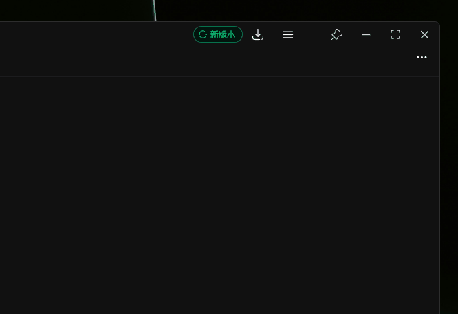
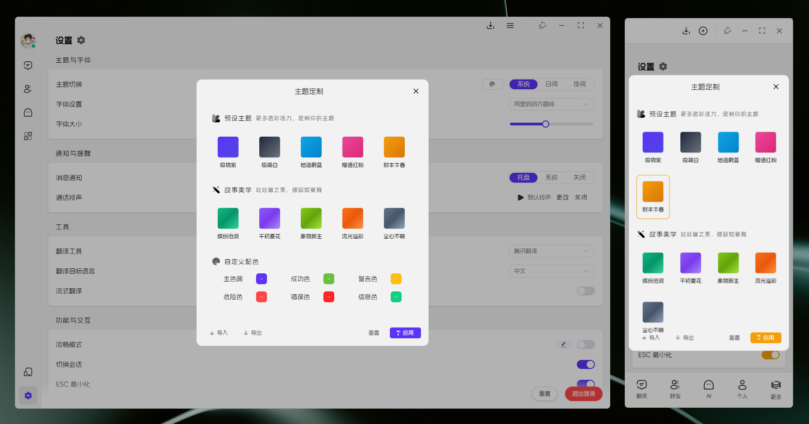
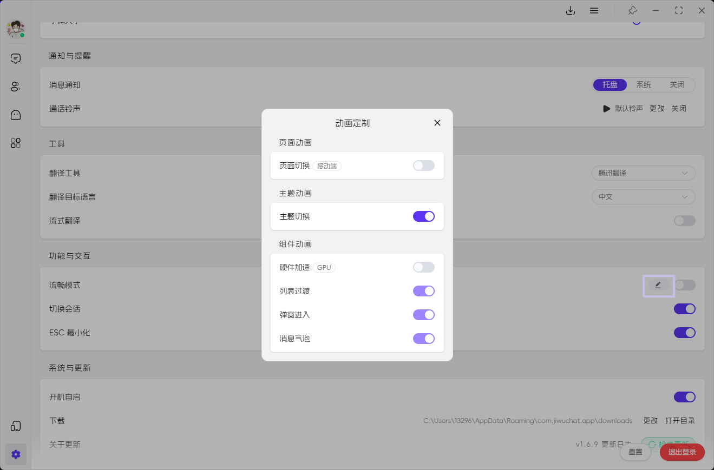
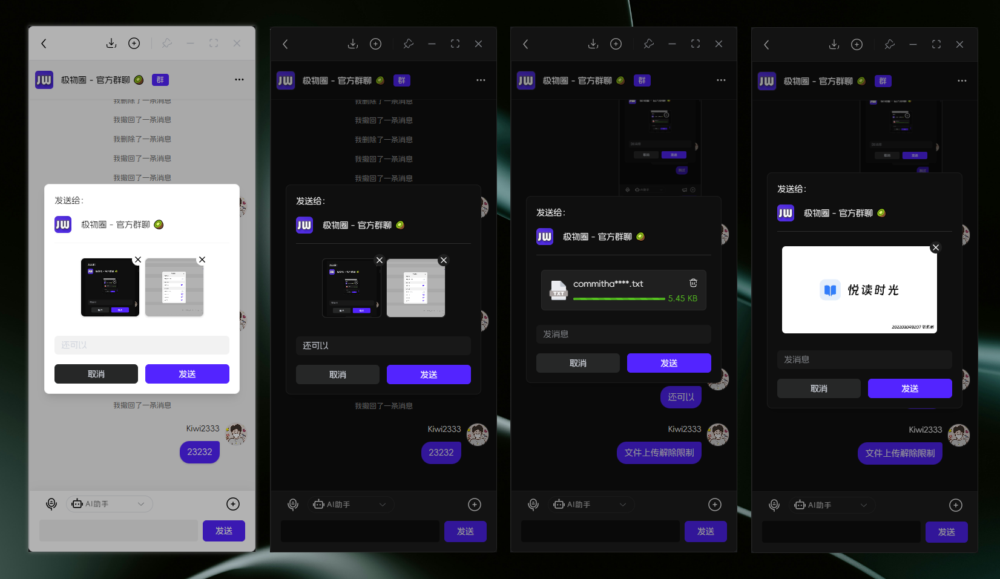
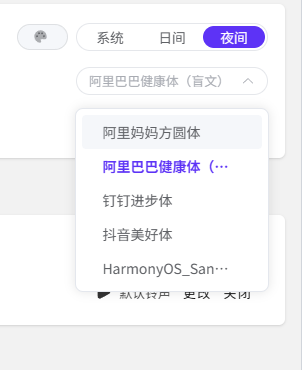

# 1.7.0 版本说明

这是一个重要的功能更新，包含多项界面优化和新功能 🚀

## ✨ 新功能

- [x] feat(updator): 新增`版本更新`提示组件  ([#d305b1a](https://github.com/KiWi233333/JiwuChat/commit/d305b1ab905c86ea77f8fbc4bbd1de211c40c0f6))
- [x] feat(Chat): 支持`批量发送文件和视频`消息  ([#ad568d5](https://github.com/KiWi233333/JiwuChat/commit/ad568d537245650089f560adef15c3317a13716c))
- [x] feat(Chat): 移动端新增`上传预览`功能  ([#c71dd5d](https://github.com/KiWi233333/JiwuChat/commit/c71dd5d7fa5b433b090a9578e0941b4565502d6b))
- [x] feat(setting): 新增`定制化主题配置`功能 🎨 ([#48cf090](https://github.com/KiWi233333/JiwuChat/commit/48cf090050b51dbceea2f9c8b188540112625ba0))
- [x] feat(setting): 新增`定制化动画设置`功能 ✨ ([#7b9be26](https://github.com/KiWi233333/JiwuChat/commit/7b9be2629c1dd82a4513fb341ee67b9fd3f05e46))
- [x] feat(init): 添加移动端 URL 打开支持 📱 ([#e452c9b](https://github.com/KiWi233333/JiwuChat/commit/e452c9bea1ddfa05f0df7b97dad8dc90423812f3))
- [x] feat(update-notice): 添加 App 版本信息`公告概要` 📢 ([#c974796](https://github.com/KiWi233333/JiwuChat/commit/c97479ddd396ff195bda5f7a20d0fd7c6e5a316c))

## 🐛 修复了以下问题

- [x] fix(msgInput): 限制输入框的快捷键操作 ⌨️ ([#1bec638](https://github.com/KiWi233333/JiwuChat/commit/1bec6389d89836877e3c7905f5fb05f7ad8f37a6))

## ⚡ 性能优化

- [x] refactor(member): 重构群组成员虚拟列表，添加下拉刷新 📋 ([#6d772e8](https://github.com/KiWi233333/JiwuChat/commit/6d772e82368561288a4155738af83a4f7f6865f3))
- [x] refactor(chat): 将群聊成员列表控制逻辑移至 chat store 📊 ([#68c3db6](https://github.com/KiWi233333/JiwuChat/commit/68c3db6c658ea732d59d2a32fc3e8158fb285a38))
- [x] refactor(components): 优化图片上传和查看功能 🖼️ ([#f41ed7e](https://github.com/KiWi233333/JiwuChat/commit/f41ed7efbce4e6595425209e01a2acf837613180))
- [x] refactor(list): 引入 createReusableTemplate 函数，创建可重用的虚拟列表内容模板  ([#e185756](https://github.com/KiWi233333/JiwuChat/commit/e185756359e2fa256921966f75ae7fa7d5e9e732))
- [x] feat(list): 为 VirtualScrollList 组件添加下拉刷新功能 📥 ([#9d1d47a](https://github.com/KiWi233333/JiwuChat/commit/9d1d47add474646fefe98cdea5fa55b7621a6ae6))

## 🎨 界面优化

- [x] feat(login): 重构登录页面样式和布局 🎨 ([#94352e9](https://github.com/KiWi233333/JiwuChat/commit/94352e9b68c115eba63bef7d298b12076cdab895))
- [x] feat(font): 添加新字体，优化加载逻辑 🔤 ([#df090e4](https://github.com/KiWi233333/JiwuChat/commit/df090e4bd39ca6e6a5d51f92f4d6c8a1e0bcb57a))
- [x] refactor(desktop): 优化窗口配置和样式 🪟 ([#a8a8eef](https://github.com/KiWi233333/JiwuChat/commit/a8a8eef9f5b932f016266170562ac111a85316af))
- [x] refactor(style): 优化字体样式和布局 ✨ ([#ef94641](https://github.com/KiWi233333/JiwuChat/commit/ef94641d7b111c24f17b7626f995d63baa47d244))
- [x] style(components): 优化聊天组件样式布局 🔧 ([#155596b](https://github.com/KiWi233333/JiwuChat/commit/155596b6ae94577e00430e6f83552bae7dc6e6c6))

## 🔧 构建优化

- [x] build(deps): 更新项目依赖版本 📦 ([#e696edf](https://github.com/KiWi233333/JiwuChat/commit/e696edf846d1f36e029103dd83e65d078013404f))
- [x] build(deps): 升级部分依赖到最新版本 📈 ([#2f7058f](https://github.com/KiWi233333/JiwuChat/commit/2f7058f8865a1fa47ed9e6fd3cb1250bacbd6bcb))

## 📝 其他优化

- [x] refactor(msgbox): 优化消息框窗口的显示和隐藏逻辑  ([#5d8357a](https://github.com/KiWi233333/JiwuChat/commit/5d8357a957676d021dbb3e678699fe9fc95a0caa))
- [x] refactor(contact): 优化会话列表加载逻辑和样式  ([#bdab8f7](https://github.com/KiWi233333/JiwuChat/commit/bdab8f76520023127ef4f6653e5c51cbdc55eb4d))
- [x] docs: 更新 LICENSE 信息  ([#c71dd5d](https://github.com/KiWi233333/JiwuChat/commit/c71dd5d7fa5b433b090a9578e0941b4565502d6b))
- [x] refactor(eslint): eslint 格式化文件  ([#d28b04a](https://github.com/KiWi233333/JiwuChat/commit/d28b04a8c1f68b3223ef34d88f95beb938365956))

## 🤯 更新描述

- [x] `版本更新提示功能`：新增应用版本检测和更新功能，支持更新进度显示和忽略更新选项

- [x] `定制化主题配置`：新增主题配置功能，支持预览主题选择、自定义配色、导入导出主题配置

- [x] `定制化动画设置`：新增动画设置功能，支持硬件加速和各类动画效果的定制化配置

- [x] `移动端上传预览`：移动端新增上传预览功能，支持文件、图片、视频的预览和撤销

- [x] `字体优化`：新增 多个字体，支持网络字体动态加载

## 🧿 其他更新

- [x] 优化群组成员虚拟列表，添加下拉刷新和上拉加载更多功能
- [x] 重构消息框窗口的显示和隐藏逻辑，优化托盘交互体验
- [x] 优化会话列表加载逻辑，提高数据加载的准确性
- [x] 添加移动端 URL 打开支持，适应微信等环境限制
- [x] 限制输入框快捷键操作，只允许常规输入框快捷键
- [x] 优化窗口配置和样式，支持边框圆角检测和阴影效果
- [x] 引入可重用的虚拟列表内容模板，提高组件性能
- [x] 将群聊成员列表控制逻辑移至 chat store，优化状态管理
- [x] 优化图片上传和查看功能，改进用户交互体验
- [x] 更新项目依赖版本，保持技术栈的最新状态
- [x] 添加 App 版本信息公告概要功能
- [x] 优化字体样式和布局，提升整体视觉效果

## 📌 待办

- [ ] 七牛OSS迁移Minio
- [ ] 本地消息存储
- [ ] 用户版本埋点
- [ ] 安卓通话悬浮窗（考虑）

## 🧪 下载

| 平台 | 下载地址 |
| --- | --- |
| Windows x86_64 setup | [JiwuChat_1.7.0_x64_zh-CN.setup](https://github.com/KiWi233333/JiwuChat/releases/download/v1.7.0/JiwuChat_1.7.0_x64-setup.exe) |
| Windows x86_64 msi | [JiwuChat_1.7.0_x64_zh-CN.msi](https://github.com/KiWi233333/JiwuChat/releases/download/v1.7.0/JiwuChat_1.7.0_x64_zh-CN.msi) |
| MacOS x64系列 | [JiwuChat_1.7.0_x64.dmg](https://github.com/KiWi233333/JiwuChat/releases/download/v1.7.0/JiwuChat_1.7.0_x64.dmg) |
| MacOS M系列 | [JiwuChat_1.7.0_aarch64.dmg](https://github.com/KiWi233333/JiwuChat/releases/download/v1.7.0/JiwuChat_1.7.0_aarch64.dmg) |
| Android arm64 | [JiwuChat_1.7.0.apk](https://github.com/KiWi233333/JiwuChat/releases/download/v1.7.0/JiwuChat_1.7.0.apk) |
| Linux AppImage | [JiwuChat_1.7.0_amd62.AppImage](https://github.com/KiWi233333/JiwuChat/releases/download/v1.7.0/JiwuChat_1.7.0_amd64.AppImage) |
| Linux RPM | [JiwuChat_1.7.0.x86_64.rpm](https://github.com/KiWi233333/JiwuChat/releases/download/v1.7.0/JiwuChat-1.7.0-1.x86_64.rpm) |
| Linux DEB | [JiwuChat_1.7.0_amd64.deb](https://github.com/KiWi233333/JiwuChat/releases/download/v1.7.0/JiwuChat_1.7.0_amd64.deb) |

- `Android arm64 版本`  安卓下载：

- 其他版本可在Release页面下载。：
**Dowload Link**: [v1.7.0 Release](https://github.com/KiWi233333/JiwuChat/releases/tag/v1.7.0)

- 版本全部变化：
**Version Info**: [Full Changelog](https://github.com/KiWi233333/JiwuChat/compare/v1.6.9...v1.7.0)
感谢大家的支持！❤ `（Star Fork Issue...）`
